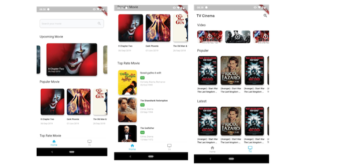

# Flutter BLoC Architecture 

flutter project built use BLoC architecture, this application implements api from [themoviedb](http://themoviedb.org)



## Getting Started

to run this project

```
  flutter pub get

  flutter run

```


## List of libraries in this project
* [Provider](https://pub.dev/packages/provider)
* [Chopper](https://pub.dev/packages/chopper)
* [Moor](https://pub.dev/packages/moor_flutter)
* [Slider](https://pub.dev/packages/carousel_slider)
* [Snaplist](https://pub.dev/packages/snaplist)
* [Intl](https://pub.dev/packages/intl)


For help getting started with Flutter, view flutter
[online documentation](https://flutter.dev/docs), which offers tutorials,
samples, guidance on mobile development, and a full API reference.


