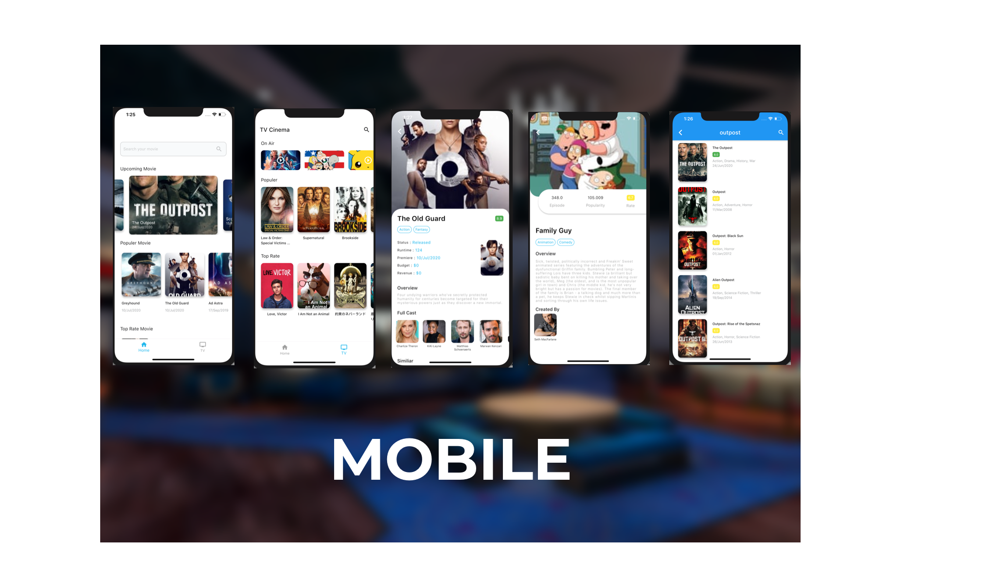
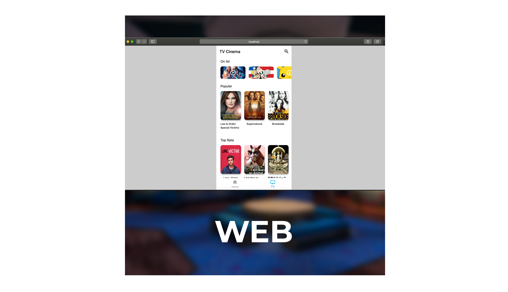

# Flutter BLoC Architecture

[](https://play.google.com/store/apps/details?id=com.bcr.cinema_flt)

Flutter project built use BLoC architecture, this application implements api from [themoviedb](http://themoviedb.org).

<p></p>
<p></p>

## Getting Started

register and get api key from [themoviedb](http://themoviedb.org)

to run this project

```
  flutter pub get

  flutter run

```

run for web

```
 flutter run -d chrome
```

run `build/web` with local server using [dhttpd](https://pub.dev/packages/dhttpd).

The results of the flutter web can be checked here [FLUTTER CINEMA](https://cahyofendhi.github.io/Flutter-Cinema/)

## List of libraries in this project

- [Flutter Bloc](https://pub.dev/packages/flutter_bloc)
- [Dio](https://pub.dev/packages/dio)
- [Hive](https://docs.hivedb.dev/)
- [Slider](https://pub.dev/packages/carousel_slider)
- [Intl](https://pub.dev/packages/intl)
- [Shimmer](https://pub.dev/packages/shimmer)

For help getting started with Flutter, view flutter
[online documentation](https://flutter.dev/docs), which offers tutorials,
samples, guidance on mobile development, and a full API reference.
